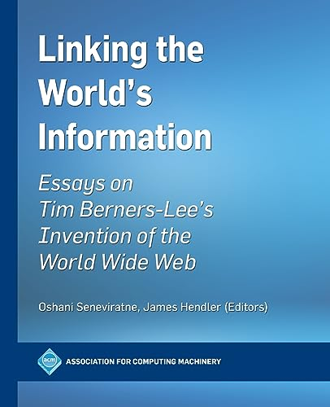

---
tags:
  - review
  - science
  - biography
date: 2024-08-18
title: "Linking the World's Information: Essays on Tim Berners-Lee's Invention of the World Wide Web - Oshani Seneviratne, James Hendler"
---

Interesting compilation of papers and writings about the Web, the W3C and Tim Berners-Lee (TBL). It paints the history of the Web that I am young enough to remember, including the initial browser wars, searche engine race, and the battle for our data and attention we're in right now.  
  
There's good variety in the topics: the history and inception of the WWW and how TBL played a crucial role in the process, the less succesful but still visionary attempt of the Semantic Web to link structured data on the Web as well, and ideas for re-decentralizing our currently partly centralized Web based on new ideas (such as the Solid project) which decouple data from the services that use it, making us the owner of our own data who gets to manage fine-grained control.  
  
Being a compilation it lacks overall story a bit and although it's very inspiring, it can also be a bit repetitive and boring.  
  
Would recommed this read though, since it definitely is inspiring, illuminating and interesting. However, perhaps you should allow yourself to skip parts that feel dull or repetitive.

---

Rating: ★★★☆☆